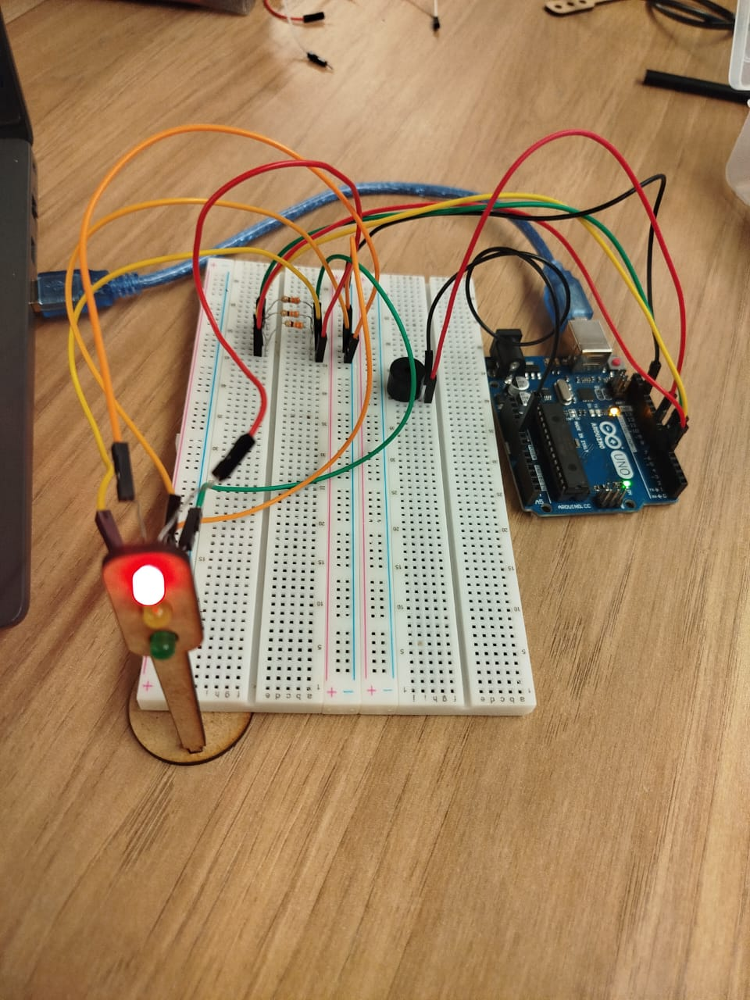

# 🚦 Projeto: Semáforo com Arduino 

## Autor
**Vitor Ribeiro**

---

## Objetivo

Desenvolver um sistema de **semáforo funcional** utilizando **Arduino, LEDs, resistores e buzzer**, capaz de controlar o fluxo de veículos de forma segura e automatizada.  
O sistema segue a lógica real de tempo e sequência das luzes: **vermelho → amarelo → verde → vermelho**, com um **alerta sonoro no amarelo**.

---

## Contexto do Projeto

  
O desafio consistia em **montar e programar um semáforo** que simulasse a garantia e a segurança de pedestres e veículos, aplicando conhecimentos de eletrônica e programação para criar um sistema essencial de controle de tráfego.

---

## Especificações do Funcionamento

O semáforo foi programado para seguir o **ciclo real** utilizado em vias urbanas:

| Cor | Duração | Função |
|------|----------|--------|
| 🔴 Vermelho | 6 segundos | Interrompe o tráfego |
| 🟡 Amarelo | 2 segundos | Alerta de transição **com buzzer** |
| 🟢 Verde | 4 segundos | Libera o tráfego |

O ciclo se repete continuamente: **verde → amarelo → vermelho → verde**.

---

## Parte 1: Montagem Física

### Componentes Utilizados

| Componente | Quantidade | Especificação / Função |
|-------------|-------------|-------------------------|
| Arduino UNO | 1 | Microcontrolador que controla o semáforo |
| Protoboard | 1 | Base para montagem dos componentes |
| LED Verde | 1 | Representa o sinal de "Siga" |
| LED Amarelo | 1 | Representa o sinal de "Atenção" |
| LED Vermelho | 1 | Representa o sinal de "Pare" |
| Buzzer | 1 | Emite som durante a fase amarela |
| Resistores | 3 | 220 Ω – Protegem os LEDs contra sobrecorrente |
| Jumpers | 12 | Realizam as conexões entre o Arduino e a protoboard |
| Cabo USB | 1 | Alimentação e comunicação com o Arduino |

---

### Ligações na Protoboard

| Componente | Pino Digital | Resistor | Ligação |
|------------|--------------|----------|---------|
| LED Vermelho 🔴 | 5 | 220 Ω | GND → Resistor → LED → Pino 5 |
| LED Amarelo 🟡 | 6 | 220 Ω | GND → Resistor → LED → Pino 6 |
| LED Verde 🟢 | 7 | 220 Ω | GND → Resistor → LED → Pino 7 |
| Buzzer | 9 | - | GND → Buzzer → Pino 9 |

<div align="center">
  <div style="margin-bottom: 1em;">
    <p style="margin-bottom: 0.3em; font-style: italic;"><strong>Projeto físico</strong></p>
    <br />
  </div>
  <sub>Fonte: autoria própria Vitor Ribeiro, 2025</sub>
</div>

---

### VÍDEO EXPLICATIVO  → https://youtube.com/shorts/dsPLUZ0FLsY?si=V5mdG4xHydw_tbU0"

----

### Justificativas da Montagem

- Os **resistores de 220 Ω** limitam a corrente e evitam a queima dos LEDs.  
- Os LEDs foram dispostos de forma **vertical (vermelho em cima, amarelo no meio, verde embaixo)**, simulando um semáforo real.  
- O **buzzer** foi adicionado para alertar durante a fase amarela.  
- Cada cor e o buzzer têm **portas digitais independentes**, controladas por um **objeto da classe `Semaforo`** no código.

---

## Parte 2: Programação e Lógica

O código foi desenvolvido em **C++ para Arduino**, aplicando conceitos de **Programação Orientada a Objetos (POO)** e **ponteiros**, tornando o projeto modular e organizado.

---

### Código Fonte

```cpp
// ----- SEMÁFORO REAL COM POO E BUZZER -----
// Autor: Vitor Ribeiro
// Descrição: Semáforo com buzzer que apita no amarelo

class Semaforo {
  private:
    int pinoVermelho;
    int pinoAmarelo;
    int pinoVerde;
    int pinoBuzzer;

  public:
    // ----- Construtor -----
    Semaforo(int vermelho, int amarelo, int verde, int buzzer) {
      pinoVermelho = vermelho;
      pinoAmarelo  = amarelo;
      pinoVerde    = verde;
      pinoBuzzer   = buzzer;

      pinMode(pinoVermelho, OUTPUT);
      pinMode(pinoAmarelo, OUTPUT);
      pinMode(pinoVerde, OUTPUT);
      pinMode(pinoBuzzer, OUTPUT);
    }

    // ----- Método auxiliar -----
    void acenderSomente(int pino) {
      digitalWrite(pinoVermelho, LOW);
      digitalWrite(pinoAmarelo, LOW);
      digitalWrite(pinoVerde, LOW);
      digitalWrite(pino, HIGH);
    }

    // ----- Fases do semáforo -----
    void verde() {
      acenderSomente(pinoVerde);
      digitalWrite(pinoBuzzer, LOW);
      delay(4000);
    }

    void amarelo() {
      acenderSomente(pinoAmarelo);
      digitalWrite(pinoBuzzer, HIGH); // liga buzzer
      delay(2000);
      digitalWrite(pinoBuzzer, LOW);  // desliga buzzer
    }

    void vermelho() {
      acenderSomente(pinoVermelho);
      digitalWrite(pinoBuzzer, LOW);
      delay(6000);
    }

    // ----- Ciclo completo -----
    void ciclo() {
      verde();
      amarelo();
      vermelho();
    }
};

// ----- Ponteiro para o objeto Semáforo -----
Semaforo* semaforo;

void setup() {
  // vermelho=5, amarelo=6, verde=7, buzzer=9
  semaforo = new Semaforo(5, 6, 7, 9);
}

void loop() {
  semaforo->ciclo();
}
